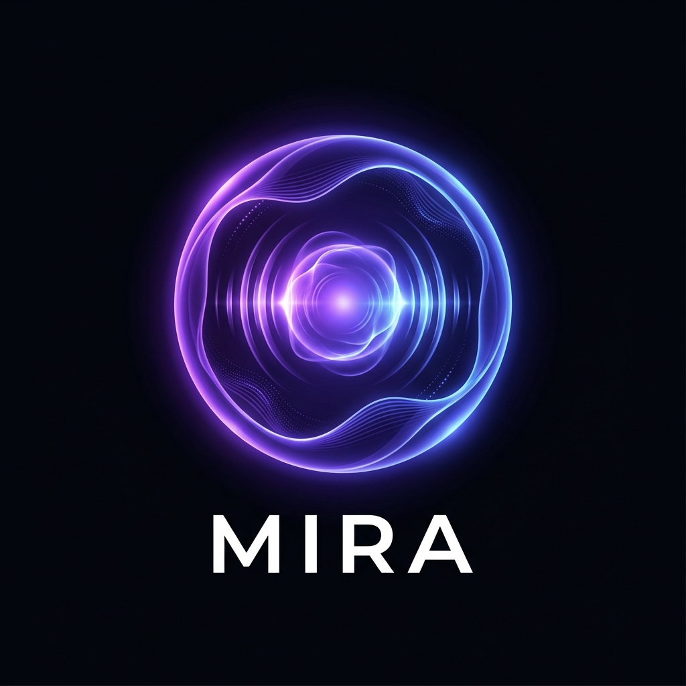
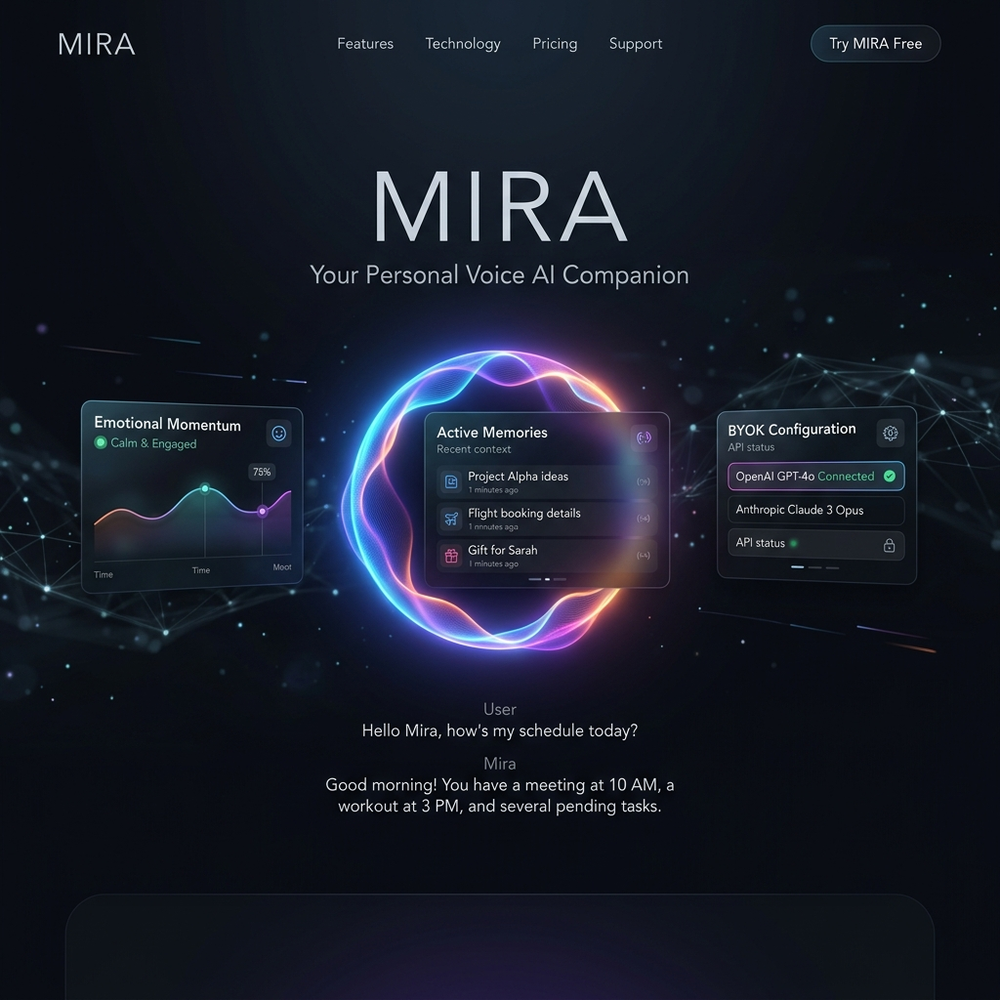

#  MIRA: Memory Integrated Realtime Agent

MIRA is a realtime, emotionally adaptive conversational voice companion engineered for ultra-low latency, fluid interruption handling, and continuous memory context. It is designed to feel conversationally alive, naturally paced, and emotionally attentive—sustainably operating with a $0 recurring infrastructure footprint via the Oracle Cloud Free Tier and browser-native audio tooling.



---

## 🌟 Core Philosophy

> **"Conversational realism matters more than raw intelligence."**

Human conversational realism is defined by timing, pacing, active listening, and context integration—not parameter counts or benchmark scores. MIRA prioritizes perceived latency over absolute backend latency by employing a pseudo-duplex conversational model, latency-masking emotional fillers, and instantaneous voice interruption recovery.

---

## 🚀 Key Features

*   **Realtime Bidirectional Streaming:** High-performance, low-latency WebSocket transport orchestrating STT, LLM tokens, and TTS chunks simultaneously.
*   **Instant Interruption Recovery:** Continuous microphone monitoring with browser-side Barge-In and Voice Activity Detection (VAD). MIRA halts playback instantly, purges stale audio queues, and propagates cancellation events back to the backend LLM/TTS streams.
*   **Emotion Engine & Momentum:** Active state machine tracking emotional momentum, sentiment shifts, vulnerability, and conversational energy to dynamically adjust the companion's pacing, tone, warmth, and curiosity.
*   **Hybrid Memory System (SQLite FTS5):** Lightweight, asynchronous SQLite full-text search combined with recency and emotional weightings to surface relevant short/long-term context without vector database overhead.
*   **Latency Masking Fillers:** Instant conversational backchannels ("hmm...", "yeah...", "that sucks...") dispatched dynamically to hide backend inference lag.
*   **BYOK (Bring Your Own Keys) Architecture:** Operates entirely on user-provided API credentials (Groq & OpenRouter), maintaining strict privacy and zero platform running costs.

---

## 🏗️ System Architecture

```
Browser Microphone Capture
    │
    ├──► Browser-Side VAD (AudioWorklets)
    ├──► Barge-In & Echo Isolation Layer
    └──► WebSocket Stream (Base64 WebM)
              │
              ▼
    Unified WebSocket Server (FastAPI)
              │
              ├──► STT Pipeline (Groq Whisper API)
              ├──► Hybrid Memory Lookup (SQLite FTS5)
              ├──► Emotion Engine & Prompt Assembly
              ├──► Streaming LLM Orchestrator (OpenRouter)
              └──► Streaming TTS Chunking (Kokoro API)
                        │
                        ▼
    Priority Audio Queue (Browser Playback)
```

---

## 📂 Repository Structure

```
mira/
├── frontend/             # Next.js App, Zustand Stores, Audio Hook Layer
│   ├── app/              # Next.js App Router Page Layouts
│   ├── components/       # Settings Panels, Orb Indicators
│   ├── audio/            # Audio Capture, VAD, and Playback Queue managers
│   └── websocket/        # Frontend WebSocket Client
├── backend/              # FastAPI Async Orchestrator
│   ├── api/              # HTTP router, WebSocket Endpoint
│   ├── websocket/        # Connection Managers, Session Handlers
│   ├── conversation/     # OpenRouter client, Filler Logic, Prompts
│   ├── stt/              # Groq Whisper Client
│   ├── tts/              # Kokoro TTS Client
│   └── memory/           # Async SQLite FTS5 database schemas
├── infra/                # Deployment and VM Configurations
│   ├── nginx/            # Nginx Reverse Proxy with WS upgrade logic
│   └── systemd/          # Linux Daemon service configurations
└── docs/                 # Documentation, deployment blueprints, and assets
```

---

## 🛠️ Step-by-Step Installation & Deployment

Refer to the complete, step-by-step deployment guide in [`MIRA_deployment_plan.md`](./docs/MIRA_deployment_plan.md) or follow the quick-start below:

### 1. Local Setup & Configuration
Copy the environment variables template and customize it:
```bash
cp .env.example .env
```
Fill in your credentials:
- `GROQ_API_KEY`: For ultra-fast Whisper speech-to-text.
- `OPENROUTER_API_KEY`: For LLM response streaming (Gemini 2.5 Flash / DeepSeek).

### 2. Run the Services (Docker Compose)
MIRA runs containerized services for a deterministic cloud setup:
```bash
docker-compose up -d
```
This launches:
- **FastAPI backend** on port `8000`
- **Kokoro TTS Server** (CPU-optimized, ARM64-ready) on port `8880`
- **Nginx Reverse Proxy** on port `80` (managing WebSocket handshakes and client traffic)

---

## 🔮 Design Aesthetics & UI

The frontend features a sleek, premium, distraction-free voice-first interface:
- **Calm Ambient Glows:** Powered by **Framer Motion**, reacting smoothly to whether MIRA is idle, listening, or actively speaking.
- **Glassmorphism Panels:** Clean settings menu overlaid with dynamic blur effects.
- **Micro-Animations:** Fluid transitions for key conversational indicators keeping the interface alive and interactive.

---

## 🛡️ License

MIRA is released under the MIT License. Feel free to use, modify, and build upon this platform for custom voice companions, local runtimes, or portfolio positioning.
